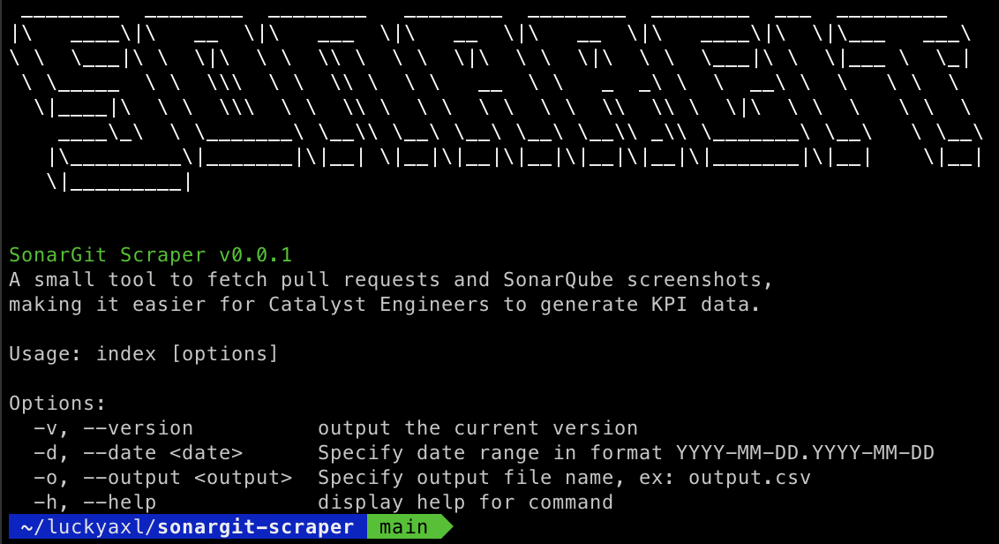

# Sonargit Scraper



A small tool to fetch pull request data and SonarQube screenshots, making it easier for Catalyst engineers to recapitulate KPI data.

## Requirements

Node 18.0 and later.

### Installation

```bash
~$: git clone https://github.com/luckyaxl/sonargit-scraper
~$: cd sonargit-scraper
~$: npm install
```

### Quick start
1.  Create the `.env` file based on `.env.example`.
2.  Run `npm` in order to install dependencies.

### Usage
```bash
~$: npm run sonargit
```

### Logs
The log file will be generated in the `logs` directory

## Function Breakdown

### Web Scraping with Puppeteer

Puppeteer is used to launch a headless browser and navigate to a SonarQube login page.
It then logs in with a provided username and password.
After logging in, it iterates through an array of pull requests, extracts information such as coverage percentage and SonarQube URL from GitHub comments, and takes a screenshot of the corresponding SonarQube page.

### GitHub API Requests

The code fetches closed pull requests from a GitHub repository within a specified date range and meeting certain criteria (e.g., merged into a specific branch, closed by a specific author).
The GitHub API is utilized to retrieve information about pull requests, including the total count and an array of items.

### Extracting SonarQube URL and Fetching Regular Comments

The `extractSonarQubeUrl` function uses a regular expression to extract the SonarQube URL from a given text.

The `fetchRegularComments` function fetches comments on a GitHub pull request, extracts coverage percentage and SonarQube URL from the latest comment, and returns the result as an object.

### Sequential Processing of Pull Requests

The `processPullRequestsSequentially` function processes an array of pull requests sequentially, fetching information about each pull request and taking a screenshot if a SonarQube URL is found.

### Usage of Moment.js

The `moment` library is used for date and time formatting.

### GitHub API Authorization

The code includes a GitHub personal access token (token) for making authenticated requests to the GitHub API.