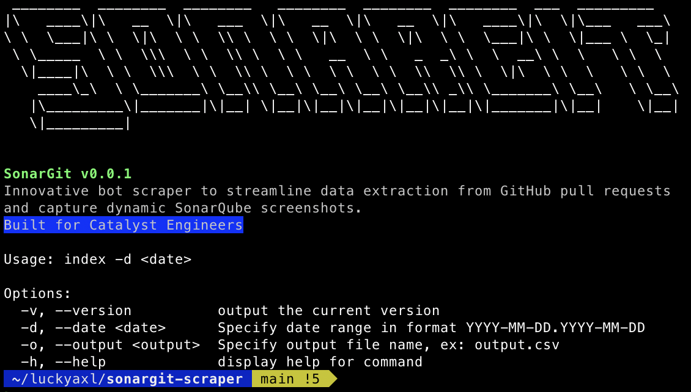

# Sonargit Scraper



Introducing Sonargit, an automated bot scraper engineered to streamline data extraction from GitHub pull requests and capture dynamic SonarQube screenshots. Tailored specifically for Catalyst engineers. Unleash productivity with a bot that effortlessly extracts, analyzes, and visualizes KPI data.

## Requirements

Node 18.0 and later.

### Installation

```bash
~$: npm install -g sonargit
```

### Example Usage

```bash
~$: sonargit -s 10/10/2023
```

### Logs

The log file will be generated in the `~/Users/<username>/sonargit` directory

## Function Breakdown

### GitHub API Requests

The code fetches closed pull requests from a GitHub repository within a specified date range and meeting certain criteria (e.g., merged into a specific branch, closed by a specific author).
The GitHub API is utilized to retrieve information about pull requests, including the total count and an array of items.

### Fetching Issue Comments and Extracting SonarQube URL

The `fetchIssueComments` function fetches comments on a GitHub pull request, extracts coverage percentage and SonarQube URL from the latest comment, and returns the result as an object.

The `extractSonarQubeUrl` function uses a regular expression to extract the SonarQube URL from a given text.

### Web Scraping with Puppeteer

Puppeteer is used to launch a headless browser and navigate to a SonarQube login page.
It then logs in with a provided username and password.
After logging in, it iterates through an array of pull requests and takes a screenshot of the corresponding SonarQube page.

### Sequential Processing of Pull Requests

The `sequentialProcess` function used to handle an array of pull requests in a sequential execution to avoid exceeding GitHub rate limits and prevent high memory usage when using Puppeteer.

### Usage of Moment.js

The `moment` library is used for date and time formatting.

### GitHub API Authorization

The code includes a GitHub personal access token (token) for making authenticated requests to the GitHub API.
