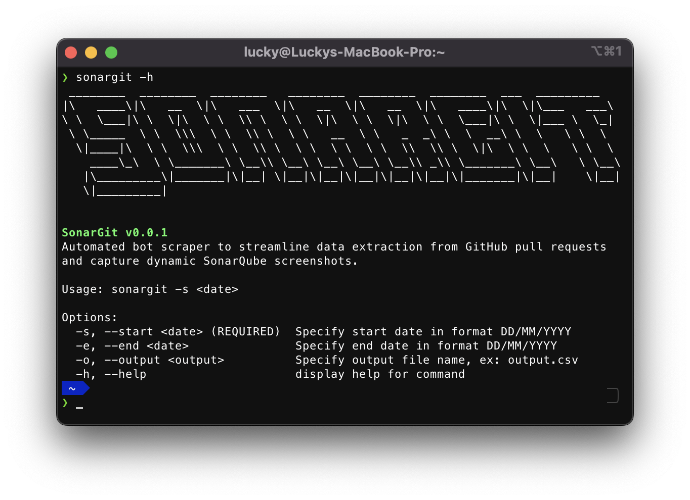

# Sonargit Scraper



Introducing Sonargit, an automated bot scraper engineered to streamline data extraction from GitHub pull requests and capture dynamic SonarQube screenshots. Built specificaly for Catalyst engineers. Gain productivity with a bot that effortlessly extracts, analyzes, and visualizes KPI data.

## Requirements

Node 18.0 and later.

### Installation

```bash
npm install -g sonargit
```

### Usage

Execute with the desired start date:

```bash
sonargit -s 10/10/2023
```


Execute with date range:

```bash
sonargit -s 10/10/2023 -e 10/12/2023
```

Execute with custom output:

```bash
sonargit -s 10/10/2023 -o my_output.csv
```

### Logs

Log files are generated in the `~/Users/<username>/sonargit` directory.

## Features

### GitHub API Integration

Sonargit will fetches closed pull requests from a GitHub repository within a specified date range and meeting certain criteria (e.g., merged into a specific branch, closed by a specific author).
The GitHub API is utilized to retrieve information about pull requests, including the total count and an array of items.

### Extracting SonarQube Data

The `fetchIssueComments` function fetches comments on a GitHub pull request, extracts coverage percentage and SonarQube URL from the latest comment, and returns the result as an object.

The `extractSonarQubeUrl` function uses a regular expression to extract the SonarQube URL from a given text.

###  Web Scraping with Puppeteer

Puppeteer is used to launch a headless browser and navigate to a SonarQube login page.
It then logs in with user provided credentials.
After logging in, it iterates through an array of pull requests and takes a screenshot of the corresponding SonarQube page.

### Sequential Processing

The `sequentialProcess` function used to handle an array of pull requests in a sequential execution to avoid exceeding GitHub rate limits and prevent high memory usage when using Puppeteer.
### Moment.js Integration

The `moment` library is used for date and time formatting.

### GitHub API Authorization

Sonargit requires a GitHub personal access token (token) for making authenticated requests to the GitHub API.

## License

Sonargit Scraper is licensed under the [MIT License](https://github.com/luckyaxl/sonargit/blob/main/LICENSE).

## Contributing

For information on contributing to Sonargit Scraper, please refer to the [Contributing Guidelines](https://github.com/luckyaxl/sonargit/blob/main/CONTRIBUTING.md).

## Support

For support and bug reporting, please open an issue on the [issue tracker](https://github.com/luckyaxl/sonargit/issues).
